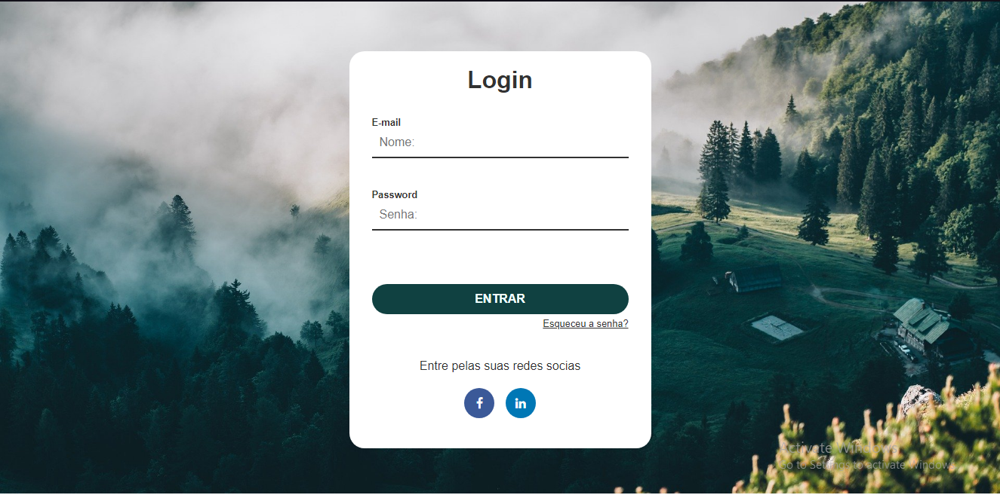

# Web_Login



## 📄 Goal:

Creating a simple login screen for better learning html and css

## ☕ Using Web_Login

to use Web_Login, follow these steps:

1. open the git bash terminal
2. enter the following code:
```
git clone https://github.com/MokdcyVictor/Sistema_Bancario.git
```
3. Compile the code by java file "Main.java"

## 🔧 Function
- [X] people registration
- [X] email and password entry
## 🙋‍♂️ Authors:
<table>
  <tr>
    <td align="center">
      <a href="#">
        <br>
        <sub>
          <b>João Mokdcy</b>
        </sub>
      </a>
    </td>
